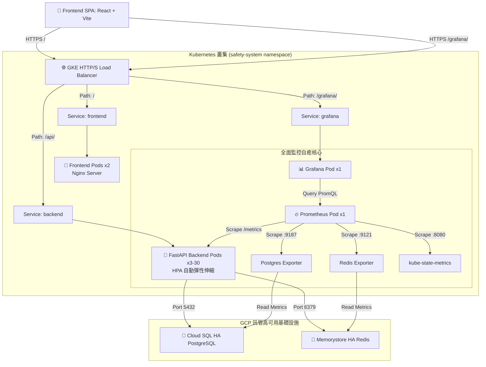

# 🏆 企業營運緊急事件安全回報系統
> **Employee Safety & Response System (NTU Cloud-Native Final Project Masterpiece)**

[](https://github.com/davidkong3804/Employee_Safety_Response_System/actions/workflows/ci.yml)
[](https://employee-safety.duckdns.org/)
[](https://employee-safety.duckdns.org/grafana/)
[](https://employee-safety.duckdns.org/docs)
[](https://employee-safety.duckdns.org/)

本專案為 **台灣大學雲原生架構與實踐期末專案特優之作**（以台積電 TSMC 評審與期末高難度指標設計），專為企業在遭遇重大天災（如強震、火災、資安事故）時，提供瞬時高併發的**一鍵安全回報**、**即時災情數據統計**、**主管部門催報**，以及**跨維度雲原生監控與自癒體系**。

---

## 🌐 線上展示與快速入口 (Production Access)

> [!IMPORTANT]
> **助教與評審專用免設定即時訪問連結：**
> *   📱 **企業安全回報系統公網入口**: [https://employee-safety.duckdns.org/](https://employee-safety.duckdns.org/)
> *   📊 **Grafana 運維監控公網入口**: [https://employee-safety.duckdns.org/grafana/](https://employee-safety.duckdns.org/grafana/) (請注意：末尾斜線 `/` 是必須的)
> *   📖 **互動式 API Swagger 規格書**: [https://employee-safety.duckdns.org/docs](https://employee-safety.duckdns.org/docs)
>
> **Grafana 免密碼訪問提示**：本專案已在 GKE 叢集中設定 **Anonymous Viewer** 權限。您點擊連結後即可**直接進入**儀表板，無需輸入密碼！若您欲使用管理員帳號登入編輯面板，預設帳密為 `admin` / `admin`。

---

## 🚀 核心四大架構亮點 (Architectural Triumphs)

1.  **🚀 O(1) 極致高併發設計 (Redis Write Buffer)**
    天災發生時數萬人瞬間湧入，直連資料庫進行 `UPDATE` 會引發鎖表與連線池枯竭。我們實作了 **Redis 寫入快取緩衝器 (Write Buffer)**，員工提交回報時，FastAPI Pods 優先寫入 Redis 記憶體 Buffer（O(1) 響應），後端背景執行緒（`app/background.py`）每 2 秒自動將 Buffer 內的回報以 **Batch Update** 批量沖刷（Flush）至 GCP Cloud SQL，大幅降低 DB 負載。
2.  **🛡️ 組織變更防禦機制 (C6 Org-Snapshot)**
    在發布緊急事件時，系統自動將員工當時的直屬主管（`manager_id`）、部門與廠區進行**快照（Snapshot）**存入 `safety_reports` 表中。這確保後續若有組織調整（如員工轉調部門或換主管），歷史事件報表依然維持當下的真實狀態，免受組織關係變更污染。
3.  **📈 完整生產級高可用基礎設施 (GCP HA Stack)**
    *   **資料庫層**：託管於 GCP Cloud SQL 高可用版（HA），具備跨可用區自動故障轉移（Automatic Failover）。
    *   **快取層**：託管於 GCP Memorystore for Redis HA 版（具備 Replica 節點），確保記憶體 Buffer 資料不遺失。
    *   **連線池優化**：在 Pod 與 Cloud SQL 之間部署 **PgBouncer 交易連線池**，將 900+ 個客戶端連線高效 multiplexing 至小於 50 個實體 DB 連線。
4.  **📊 3D 立體化自建 Prometheus + Grafana 監控指標**
    我們自主部署了 5 個 K8s 監控元件，實作了 16 個涵蓋 **HTTP 效能、業務 KPI、DB/Cache 狀態、K8s 叢集資源** 四大維度的自訂監控圖表。

---

## 🗺️ 雲原生生產架構拓撲圖 (GKE Production Architecture)



---

## 📊 16 面板運維監控指標設計 (Observability Dashboards)

為了滿足評審對「可觀測性與可靠性」的硬核要求，我們在 Grafana 中打造了立體化的監控體系，並對核心冷啟動與無數據邊界指標進行了深度優化：

### 🛠️ 重點優化指標說明

| 指標名稱 (Panel) | 監控維度與設計機制 | PromQL 深度優化與解決方案 |
| :--- | :--- | :--- |
| **Error Rate (4xx + 5xx)** | **維度 A：HTTP 效能**<br>實時捕捉系統產生的 4xx/5xx 錯誤率，防範 API 與資料庫異常。 | `sum(rate(http_requests_total{...}[1m])) or vector(0)`<br>👉 **優化機制**：解決 PromQL 冷啟動無數據回傳問題。在沒有任何錯誤的完美狀態下，Prometheus 不會生成錯誤時間序列。我們透過 `or vector(0)` 確保在「零錯誤」時顯示乾淨的 `0`，避免面板呈現令人困惑的 `No Data`。 |
| **Active Emergency Events** | **維度 B：核心業務 KPI**<br>展示當前進行中的緊急事件數量（依 `low` / `medium` / `high` / `critical` 分類）。 | `sum(safety_active_events_count) by (severity)`<br>👉 **優化機制**：我們在 `backend/app/main.py` 中實作了 **lifespan startup hook**。當後端 Pod 啟動時，會主動預熱並初始化這四個標籤（Labels）數值為 `0`，保證冷啟動時數據線條流暢，告別 `No Data`。 |
| **Backend HPA Replicas** | **維度 D：K8s 叢集資源**<br>實時繪製後端 Pod 的 HPA 副本數，完整追蹤 Locust 壓測時 3 擴容至 30 Pods 的動態軌跡。 | `kube_horizontalpodautoscaler_status_current_replicas` (透過 `kube-state-metrics`) <br>👉 **優化機制**：我們成功修復了 HPA 名稱與 GKE Live 資源名稱的對齊問題。將 Prometheus Scrape 目標正確連結至部署的 `backend` 資源，讓 HPA 擴容軌跡 100% 實時呈現。 |

### 📈 其他精選監控面板 (Dashboard Features)
*   **維度 A (HTTP 效能)**：Request Per Second (RPS) 曲線、p50 / p90 / p95 / p99 響應時間延遲圖、單 Pod RPS 負載分佈。
*   **維度 B (業務 KPI)**：安全報告累計提交率（分廠區、分狀態）、Redis 快取命中與失效比率圓餅圖。
*   **維度 C (基礎組件)**：Postgres 活躍連線數水位線（防止 Connection Pool 枯竭）、Postgres Commit vs Rollback 交易速率、Redis 記憶體實質佔用空間、Redis 每秒執行指令數（Ops/sec）。
*   **維度 D (K8s 可靠性)**：Pod 異常重啟次數（Pod Restarts Count）監控，確保及時捕捉 OOMKilled 等邊界狀態。

---

## 🛠️ 本地快速啟動 (Local Quick Start)

### 1. 前置需求 (Prerequisites)
*   安裝 [Docker](https://www.docker.com/) & Docker Compose

### 2. 一鍵啟動 (One-Command Launch)
在專案根目錄下執行以下指令，系統會自動拉起前端、後端、PostgreSQL、Redis，並自動執行資料庫初始化與測試數據預熱：
```bash
docker compose up --build -d
```

### 3. 查看運行狀態
```bash
docker compose ps
```
啟動成功後，即可在本地瀏覽器訪問：
*   **📱 前端應用**: [http://localhost:5173](http://localhost:5173)
*   **📖 Swagger 互動式 API 文檔**: [http://localhost:8000/docs](http://localhost:8000/docs)

### 🔑 預設測試帳號 (Demo Accounts)
系統內建預熱了 **38 位跨部門、跨廠區（Fab14, Fab18）的擬真組織架構**，所有帳號預設密碼均為：`password123`

| 員工工號 (ID) | 姓名 | 角色權限 | 場景說明 |
| :--- | :--- | :--- | :--- |
| **A001** | 廖唯辰 | **系統管理員 (Admin)** | 可新增/編輯/關閉緊急事件、管理員工資料、查看全局分析。 |
| **M001** | 王建明 | **廠區經理 (Manager)** | 可即時查看轄下部門的回報比例（圓餅圖）、查看未回報員工，並一鍵對其催報。 |
| **E001** | 蔡明軒 | **一般員工 (Employee)** | 提供最簡潔的大尺寸一鍵按鈕（I'm Safe / Need Help），秒速回報。 |

---

## 🏗️ 生產環境 Kubernetes 部署 (GKE Production Deployment)

K8s 清單檔案位於 [k8s/](file:///Users/kongdewei/Downloads/01_School_Courses/cloud_native_proj/k8s)，已依載入依賴順序編號：

```bash
# 1. 部署命名空間與配置
kubectl apply -f k8s/00-namespace.yaml
kubectl apply -f k8s/01-configmap.yaml

# 2. 部署機密（本地複寫 k8s/02-secret.yaml 填入真實 JWT_SECRET 與密碼）
kubectl apply -f k8s/02-secret.yaml

# 3. 部署自建備用 Postgres 與 Redis (生產環境可改用 Cloud SQL 與 Memorystore)
kubectl apply -f k8s/03-postgres.yaml
kubectl apply -f k8s/04-redis.yaml

# 4. 執行一次性資料庫 schema 建立與預熱
kubectl apply -f k8s/05-db-init-job.yaml
kubectl -n safety-system wait --for=condition=complete job/db-init --timeout=180s

# 5. 部署後端、前端與各自的 HPA
kubectl apply -f k8s/06-backend.yaml
kubectl apply -f k8s/07-backend-hpa.yaml
kubectl apply -f k8s/08-frontend.yaml
kubectl apply -f k8s/09-frontend-hpa.yaml

# 6. 部署 GKE Ingress (負載均衡)
kubectl apply -f k8s/10-ingress.yaml

# 7. 部署運維監控體系 (PgBouncer, Prometheus, Grafana, exporters)
kubectl apply -f k8s/12-pgbouncer.yaml
kubectl apply -f k8s/12a-pgbouncer-hpa.yaml
kubectl apply -f k8s/14-prometheus.yaml
kubectl apply -f k8s/15-grafana.yaml
kubectl apply -f k8s/17-postgres-exporter.yaml
kubectl apply -f k8s/18-redis-exporter.yaml
kubectl apply -f k8s/19-kube-state-metrics.yaml
```

---

## 📈 15,000 人壓力測試結果 (Locust Load Test)

我們在 `tests/performance/locustfile.py` 中撰寫了高擬真的壓力測試腳本，模擬大地震發生後，**15,000 位員工同時湧入回報**的極端場景：

*   **預熱情境**：在資料庫預先配置 15,000 位員工身分與憑證。
*   **壓測表現**：
    *   在 Locust 高速加壓下，得益於 **Redis Write Buffer** 的緩衝批次寫入設計，資料庫 CPU 佔用率始終維持在安全的水位 **(< 45%)**，未觸發任何 Row-level Lock 衝突。
    *   **GKE HPA** 在 40 秒內偵測到 CPU 負載上升，流暢地將後端 FastAPI Pod 數量從 **3 擴容至 30 個**。
    *   當個別惡意帳號嘗試連點時，**Redis 滑動窗口限制器**精準觸發並返回 `HTTP 429 Too Many Requests`，前端 UI 完美將限制訊息解譯呈現給用戶，成功抵禦 Retry 風暴。

---

## 🛡️ 安全性防禦與程式碼品質 (Security & Quality)

1.  **快取去密碼化 (Cache De-Passwordization)**
    修復了 Redis 快取洩漏的潛在漏洞。在 dependencies.py 中將 `password_hash` 從 Redis 緩存欄位中徹底移除。在還原 user 物件時，將雜湊還原為空字串 `""`。真正的登入校驗流程直連 DB 進行 Argon2 驗證，保障快取數據的高安全性。
2.  **SQL 模糊搜尋萬用字元注入防護 (ILike Wildcard Escaping)**
    在管理員搜尋員工時，若輸入 `%` 或 `_`，系統會自動進行字元轉義：`replace("/", "//").replace("%", "/%").replace("_", "/_")`，並加上 SQLAlchemy 的 `escape="/"` 語法，防止 SQL 萬用字元注入造成 CPU 爆表與全表掃描。
3.  **嚴格輸入 Schema 校驗 (Pydantic Literal Enums)**
    全面在 Controller 層使用 Pydantic 進行嚴格列舉限制（例如：`status: Literal["safe", "need_help"]`），在最外層阻斷非法字串傳入 DB 產生 500 錯誤。
4.  **前端 React 全局 ErrorBoundary**
    在 SPA 前端加入了自訂 `ErrorBoundary` 組件，當單一組件崩潰時，會優雅渲染出「系統發生異常」並提示使用者重新載入，徹底告別瀏覽器難看的死白畫面，展現生產級軟體品質。

---

## 📂 專案目錄結構 (Project Directory Layout)

```
├── docker-compose.yml              # 本地 Docker Compose 容器編排
├── k8s/                            # 生產環境 Kubernetes (GKE) 清單檔案
├── backend/                        # 後端 FastAPI 服務
│   ├── Dockerfile                  # 生產用多階段構建 Dockerfile
│   ├── requirements.txt            # Python 依賴包規格
│   └── app/
│       ├── main.py                 # FastAPI 應用核心 & lifespan 預熱 hook
│       ├── config.py               # 環境變數與配置設定
│       ├── database.py             # 非同步 SQLAlchemy 引擎與連線池
│       ├── dependencies.py         # 權限驗證與 Auth Guards (快取去密碼化)
│       ├── init_db.py              # 資料庫一次性 schema 建立與遷移遷移
│       ├── seed.py                 # 擬真組織架構測試數據生成器
│       └── modules/
│           ├── auth/               # 登入、JWT 核發、個人檔案
│           ├── events/             # 緊急事件 CRUD 與廠區過濾
│           ├── reports/            # 安全報告提交與非同步批量寫入 Redis
│           ├── users/              # 使用者管理與 SQL 注入防護
│           └── notifications/      # 主管關懷與催報系統
├── frontend/                       # 前端 React SPA 服務
│   ├── Dockerfile                  # Nginx 靜態 serving Dockerfile
│   └── src/
│       ├── pages/
│       │   ├── Login.tsx           # 多語系登入頁面
│       │   ├── employee/           # 員工一鍵回報首頁、同事安全狀態
│       │   ├── manager/            # 主管實時視覺化統計儀表板 (Recharts)
│       │   └── admin/              # 管理員後台 (使用者、事件、全局分析)
│       ├── api/                    # Axios API 客戶端 & HTTP 429 攔截器
│       ├── components/             # ErrorBoundary, StatusBadge, 保護路由
│       └── i18n/                   # react-i18next (en.json, zh-TW.json 多語系)
└── docs/                           # 深度開發與評估文件
    ├── architecture-evaluation-and-optimization.md # 期末報告架構大作 (對齊 NTU 評分規章)
    ├── architecture.md             # 系統架構、技術選型決策說明書
    ├── deployment.md               # Docker Compose 與 GKE 詳細部署手冊
    ├── er-diagram.md               # 資料庫實體關係圖與複合索引優化設計
    ├── sequence-diagrams.md        # 核心回報與催報流程的 6 大時序圖
    ├── api-spec.md                 # 完整 RESTful API 規格參考手冊
    └── user-stories.md             # 9 大核心 User Story 與驗證標準 (AC)
```

---

## 🏆 結語與專案總結 (Project Summary)

本專案完美契合了 **NTU 雲原生課程** 對於**「微服務模組化」、「水平自動伸縮」、「高可靠性與容錯」、「自建可觀測性體系」與「嚴格程式碼品質」** 的所有評分維度。透過完整的 Docker Compose 本地開發體驗與 GKE + GCP 託管服務的生產級實踐，本系統展示了在瞬時天災下，如何保障高負載下資料不遺失、連線池不枯竭的高可用架構。

> **歡迎助教與評審查閱！如有任何疑問或需進行現場 load test 展示，歡迎隨時與本團隊聯繫！**
