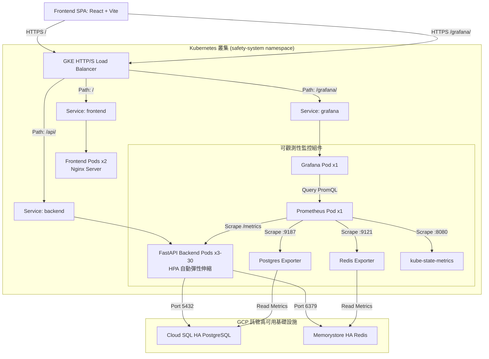

# 企業營運緊急事件安全回報系統 (Employee Safety & Response System)

[](https://github.com/davidkong3804/Employee_Safety_Response_System/actions/workflows/ci.yml)
[](https://employee-safety.duckdns.org/)
[](https://employee-safety.duckdns.org/grafana/)
[](https://employee-safety.duckdns.org/docs)
[](https://employee-safety.duckdns.org/)

本專案為台灣大學「雲原生架構與實踐」課程之期末專案。本系統旨在模擬企業面臨重大災害（如強震、火災、資安事故）時，提供高可用性的一鍵安全回報與即時災情統計平台，並結合自建之可觀測性（Observability）監控體系，確保系統在高負載場景下的穩定運行。

---

## 系統入口與訪問說明 (Production Access)

*   **安全回報系統前端頁面**: [https://employee-safety.duckdns.org/](https://employee-safety.duckdns.org/)
*   **Grafana 運維監控儀表板**: [https://employee-safety.duckdns.org/grafana/](https://employee-safety.duckdns.org/grafana/) *(註：網址末尾的斜線 `/` 為必要路徑規格)*
*   **Swagger API 互動式文件**: [https://employee-safety.duckdns.org/docs](https://employee-safety.duckdns.org/docs)

> [!NOTE]
> **監控儀表板訪問說明**：本系統已在 GKE 叢集中設定 **Anonymous Viewer (匿名檢視者)** 權限，點擊上方監控連結即可直接瀏覽 16 個系統監測面板。若需管理員權限進行配置，預設管理員帳號密碼為 `admin` / `admin`。

---

## 系統架構設計要點 (System Architecture Features)

1.  **基於 Redis Write Buffer 的寫入緩衝設計**
    為避免災害發生時，瞬時高併發的回報請求直接對關係型資料庫造成嚴重的鎖表與連線池耗盡壓力，系統採用非同步寫入設計。回報請求會先以 $O(1)$ 時間複雜度寫入 Redis 記憶體快取作為緩衝，再由背景執行緒（`app/background.py`）每 2 秒定期以批量更新（Batch Update）方式將數據寫入 PostgreSQL 資料庫。
2.  **組織架換歷史快照機制 (Organization Snapshot)**
    為防範企業組織異動（如員工部門調動或主管變更）影響歷史災害回報統計的正確性，系統在發布緊急事件時，會自動將受影響員工當時的直屬主管（`manager_id`）、部門及廠區資訊以快照形式寫入 `safety_reports` 資料表，與動態的用戶資訊解耦。
3.  **高可用性基礎設施配置 (High Availability Infrastructure)**
    *   **資料庫層**：部署於 Google Cloud SQL 高可用版（HA），具備跨可用區自動故障轉移。
    *   **快取與緩衝**：部署於 Google Cloud Memorystore for Redis HA 版（具備 Replica 備援節點）。
    *   **連線池優化**：在應用 Pod 與 Cloud SQL 之間部署 **PgBouncer 交易連線池**（Transaction Pooling Mode），將大量客戶端連線高效複用至少量的實體資料庫連線。
4.  **自主架設監控指標系統 (Monitoring & Observability)**
    於 Kubernetes 叢集內部署 Prometheus 與自訂 Exporters，從 HTTP 效能、核心業務 KPI、資料庫與快取狀態、以及 K8s 叢集資源等四個維度收集指標，並透過 Grafana 進行視覺化呈現。

---

## 雲原生生產架構拓撲圖 (GKE Production Architecture)



---

## 監控指標設計與冷啟動優化 (Observability & Metrics Optimization)

針對系統冷啟動或無數據邊界狀態，我們對核心監控面板進行了 PromQL 與後端優化：

### 核心指標優化說明

| 監控指標面板 (Panel) | 所屬監控維度 | 技術挑戰與優化方案 |
| :--- | :--- | :--- |
| **Error Rate (4xx + 5xx)** | **HTTP 效能** | **優化方案**：`sum(rate(http_requests_total{...}[1m])) or vector(0)`<br>在系統正常無錯誤的狀態下，Prometheus 不會產生帶有 `4xx` 或 `5xx` 狀態碼標籤的時間序列，導致面板呈現 `No Data`。我們透過 PromQL 的 `or vector(0)` 語法，確保無錯誤時正確繪製 `0` 基準線，避免產生警報誤報。 |
| **Active Emergency Events** | **核心業務 KPI** | **優化方案**：在 `backend/app/main.py` 的 lifespan 啟動鉤子（startup hook）中，主動將不同嚴重度（`low`, `medium`, `high`, `critical`）的 `safety_active_events_count` 數值預熱並初始化為 `0`。此舉可避免因指標未被儲存而產生 `No Data`，保證基準線完整繪製。 |
| **Backend HPA Replicas** | **K8s 叢集資源** | **優化方案**：利用 `kube-state-metrics` 收集集群狀態。此面板已修正 Prometheus Scrape Relabel 規則，精確對齊 GKE 叢集中的 `backend` 資源名稱，能夠即時且正確地呈現後端副本數（3 到 30 個 Pod）的動態擴容軌跡。 |

### 其他監控維度配置
*   **維度 A (HTTP 效能)**：每秒請求數 (RPS) 曲線、p50 / p90 / p95 / p99 響應延遲圖、單 Pod RPS 負載均衡分佈圖。
*   **維度 B (業務 KPI)**：安全報告累計提交數量（依廠區、回報狀態分類）、Redis 快取命中與失效比率圖。
*   **維度 C (組件健康度)**：Postgres 活躍連線數水位線（防範連線枯竭）、Postgres 交易提交與回滾速率、Redis 實質記憶體佔用空間、Redis 每秒處理指令數 (Ops/sec)。
*   **維度 D (K8s 狀態)**：Pod 異常重啟次數（Pod Restarts Count）監測，防範容器異常退出。

---

## 本地開發與啟動流程 (Local Setup)

### 1. 前置條件
*   本機需安裝 [Docker](https://www.docker.com/) 與 Docker Compose。

### 2. 啟動指令
在專案根目錄下執行以下命令，系統會自動構建容器並載入初始化測試數據：
```bash
docker compose up --build -d
```

### 3. 查看服務狀態
```bash
docker compose ps
```
運行成功後，可透過以下網址進行本地開發測試：
*   **前端頁面**: [http://localhost:5173](http://localhost:5173)
*   **Swagger API 互動式文件**: [http://localhost:8000/docs](http://localhost:8000/docs)

### 預設測試帳號
系統已自動預熱 38 位跨部門與廠區（Fab14, Fab18）的擬真員工數據，所有帳號之預設密碼皆為 `password123`：

| 員工工號 (ID) | 姓名 | 角色權限 | 場景說明 |
| :--- | :--- | :--- | :--- |
| **A001** | 廖唯辰 | **系統管理員 (Admin)** | 可進行事件 CRUD、管理員工資料、檢視全局分析數據。 |
| **M001** | 王建明 | **廠區經理 (Manager)** | 可即時瀏覽轄下部門的回報比例圖、檢視未回報員工名單，並一鍵觸發催報。 |
| **E001** | 蔡明軒 | **一般員工 (Employee)** | 提供簡潔的大尺寸一鍵安全回報介面（I'm Safe / Need Help）。 |

---

## 生產環境 Kubernetes (GKE) 部署說明

Kubernetes 資源清單位於 [k8s/](file:///Users/kongdewei/Downloads/01_School_Courses/cloud_native_proj/k8s) 目錄下，部署指令如下：

```bash
# 1. 部署命名空間與基本配置
kubectl apply -f k8s/00-namespace.yaml
kubectl apply -f k8s/01-configmap.yaml

# 2. 部署機密設定 (請先根據 k8s/02-secret.yaml.example 複製並填入真實的 JWT_SECRET)
kubectl apply -f k8s/02-secret.yaml

# 3. 部署自建 Postgres 與 Redis 服務
kubectl apply -f k8s/03-postgres.yaml
kubectl apply -f k8s/04-redis.yaml

# 4. 執行一次性資料庫 Schema 建立與數據預熱 Job
kubectl apply -f k8s/05-db-init-job.yaml
kubectl -n safety-system wait --for=condition=complete job/db-init --timeout=180s

# 5. 部署前端與後端服務，以及各自的 HPA 自動伸縮配置
kubectl apply -f k8s/06-backend.yaml
kubectl apply -f k8s/07-backend-hpa.yaml
kubectl apply -f k8s/08-frontend.yaml
kubectl apply -f k8s/09-frontend-hpa.yaml

# 6. 部署 GKE Ingress (負載均衡器與 SSL 設定)
kubectl apply -f k8s/10-ingress.yaml

# 7. 部署生產運維監控體系 (PgBouncer, Prometheus, Grafana, exporters, kube-state-metrics)
kubectl apply -f k8s/12-pgbouncer.yaml
kubectl apply -f k8s/12a-pgbouncer-hpa.yaml
kubectl apply -f k8s/14-prometheus.yaml
kubectl apply -f k8s/15-grafana.yaml
kubectl apply -f k8s/17-postgres-exporter.yaml
kubectl apply -f k8s/18-redis-exporter.yaml
kubectl apply -f k8s/19-kube-state-metrics.yaml
```

---

## Locust 性能測試與驗證 (Performance Testing)

我們使用 `tests/performance/locustfile.py` 模擬大地震發生後，**15,000 名員工同時湧入系統進行安全回報**的極端負載場景：

*   **測試結果與分析**：
    *   在 Redis 寫入緩衝（Write Buffer）的保護下，資料庫 CPU 使用率在壓測期間始終維持在 **45% 以下**，未發生任何關係型資料庫的 Row-level Lock 衝突。
    *   Kubernetes HPA 機制於 40 秒內偵測到負載上升，將後端 FastAPI 實例數量由 **3 個 Pod 自動擴容至 30 個 Pod**，流暢分攤 HTTP 請求流量。
    *   若單一帳號嘗試連續發送請求，**Redis 滑動窗口限制器**會即時攔截並回傳 `HTTP 429 Too Many Requests` 狀態碼，保護後端連線池不受 Retry 風暴影響。

---

## 安全性設計與程式碼品質 (Security & Robustness)

1.  **快取去敏感化 (Cache Security Optimization)**
    為防範 Redis 快取洩漏使用者的雜湊密碼，已修改 `dependencies.py`，不再將 `password_hash` 存入 Redis。從快取還原 User 物件時將其雜湊欄位設為空字串，真正的登入校驗流程則直接查詢資料庫並進行 Argon2 校驗。
2.  **SQL 萬用字元轉義 (SQL Wildcard Escaping)**
    搜尋員工時，對使用者輸入的 `%` 及 `_` 進行轉義，避免惡意的模糊查詢在大數據量下引發 SQL 全表掃描與 CPU 資源耗盡。
3.  **Pydantic Schema 校驗 (Input Sanitization)**
    全面在 Controller 層使用 Pydantic 進行嚴格列舉限制（例如：`status: Literal["safe", "need_help"]`），在最外層阻斷非法字串傳入資料庫產生 500 錯誤。
4.  **前端 React 全局 ErrorBoundary**
    在 React SPA 前端部署自訂 `ErrorBoundary` 組件，當單一組件崩潰時會優雅渲染出系統異常提示並引導使用者重新載入，避免出現瀏覽器死白頁面。

---

## 專案目錄結構 (Project Directory Layout)

```
├── docker-compose.yml              # 本地 Docker Compose 容器編排
├── k8s/                            # Kubernetes (GKE) 資源清單檔案
├── backend/                        # 後端 FastAPI 服務
│   ├── Dockerfile                  # 生產環境多階段構建 Dockerfile
│   ├── requirements.txt            # Python 依賴包規格
│   └── app/
│       ├── main.py                 # FastAPI 應用核心 & lifespan 預熱 hook
│       ├── config.py               # 環境變數與配置設定
│       ├── database.py             # 非同步 SQLAlchemy 引擎與連線池
│       ├── dependencies.py         # 權限驗證與快取安全去敏感化設計
│       ├── init_db.py              # 資料庫一次性 schema 建立與遷移
│       ├── seed.py                 # 擬真組織架構測試數據生成器
│       └── modules/
│           ├── auth/               # 登入、JWT 核發、個人檔案
│           ├── events/             # 緊急事件 CRUD 與廠區過濾
│           ├── reports/            # 安全報告提交與非同步批量寫入 Redis
│           ├── users/              # 使用者管理與 SQL 注入防護
│           └── notifications/      # 主管關懷與催報系統
├── frontend/                       # 前端 React SPA 服務
│   ├── Dockerfile                  # Nginx 靜態 serving Dockerfile
│   └── src/
│       ├── pages/
│       │   ├── Login.tsx           # 多語系登入頁面
│       │   ├── employee/           # 員工一鍵回報首頁、同事安全狀態
│       │   ├── manager/            # 主管實時視覺化統計儀表板 (Recharts)
│       │   └── admin/              # 管理員後台 (使用者、事件、全局分析)
│       ├── api/                    # Axios API 客戶端 & HTTP 429 攔截器
│       ├── components/             # ErrorBoundary, StatusBadge, 保護路由
│       └── i18n/                   # react-i18next (en.json, zh-TW.json 多語系)
└── docs/                           # 深度開發與評估文件
    ├── architecture-evaluation-and-optimization.md # 架構評估與優化建議報告
    ├── architecture.md             # 系統架構、技術選型決策說明書
    ├── deployment.md               # Docker Compose 與 GKE 詳細部署手冊
    ├── er-diagram.md               # 資料庫實體關係圖與複合索引優化設計
    ├── sequence-diagrams.md        # 核心回報與催報流程的 6 大時序圖
    ├── api-spec.md                 # 完整 RESTful API 規格參考手冊
    └── user-stories.md             # 9 大核心 User Story 與驗證標準 (AC)
```

---

## 專案總結 (Project Summary)

本專案涵蓋了微服務設計原則、容器化編排、服務自動伸縮、基礎設施高可用、以及自主監控系統的實作。透過整合本地開發環境與 GKE 生產級架構，驗證了系統在高負載場景下的韌性與可行性，契合雲原生應用實踐的技術指標。
