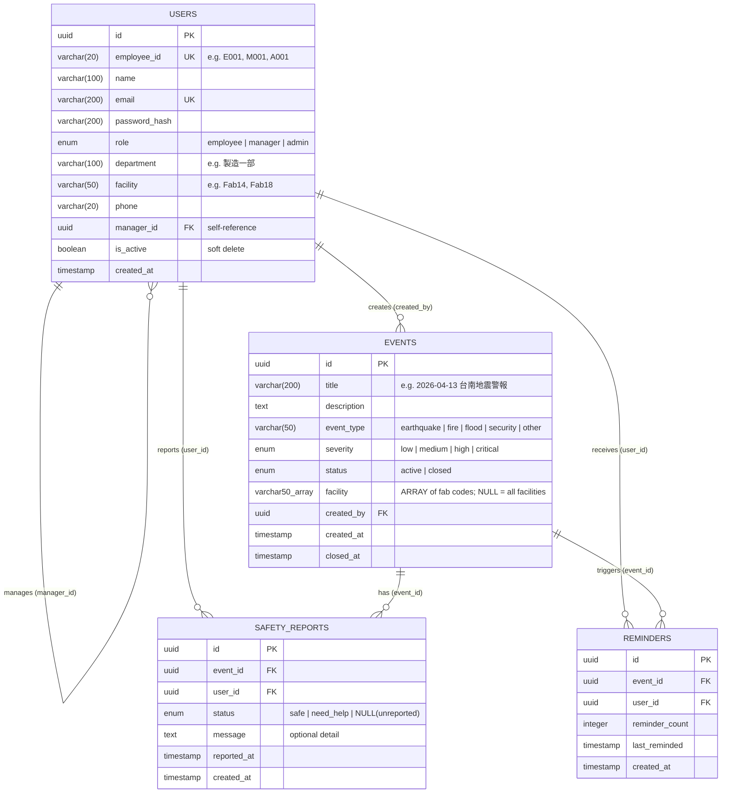

# Entity-Relationship Diagram

## ER Diagram (Mermaid)



## Table Details

### users
The central entity representing all system users across three roles.
- **Self-referential FK**: `manager_id` references `users.id`, enabling org hierarchy.
- **Soft delete**: `is_active = false` instead of actual deletion preserves historical data.
- **Indexes**: `employee_id` (unique), `email` (unique), `manager_id`, `(department, facility)`

### events
Emergency events created by administrators.
- **Lifecycle**: `active` → `closed` (sets `closed_at` timestamp)
- **Types**: earthquake, fire, flood, security, other
- **Facility scoping**: `facility` is a Postgres `VARCHAR(50)[]` (`ARRAY(String(50))` in SQLAlchemy). Holds the fab codes affected by the event (e.g. `['Fab14', 'Fab18']`). `NULL` / empty means **all facilities** — the event is global.
- **On creation**: automatically generates one `safety_report` placeholder per active user; if `facility` is non-empty, only users whose `User.facility` is in that list get a placeholder.

### safety_reports
Core reporting table with one record per user per event.
- **Unique constraint**: `(event_id, user_id)` — each user can only have one report per event
- **Status lifecycle**: `NULL` (unreported) → `safe` or `need_help`
- **Indexes**: `(event_id, status)` for dashboard aggregation queries

### reminders
Tracks notification attempts for unreported employees.
- **Increment pattern**: each reminder trigger increments `reminder_count` and updates `last_reminded`
- Enables tracking escalation frequency per employee

## Key Queries

### Dashboard Stats (most frequent query)
```sql
SELECT status, COUNT(*)
FROM safety_reports
WHERE event_id = :event_id
GROUP BY status;
```

### Department Breakdown
```sql
SELECT u.department, sr.status, COUNT(*)
FROM safety_reports sr
JOIN users u ON sr.user_id = u.id
WHERE sr.event_id = :event_id
GROUP BY u.department, sr.status;
```

### Manager's Team Status
```sql
SELECT sr.*, u.name, u.employee_id, u.department
FROM safety_reports sr
JOIN users u ON sr.user_id = u.id
WHERE sr.event_id = :event_id
AND (u.manager_id = :manager_id OR u.id = :manager_id);
```
