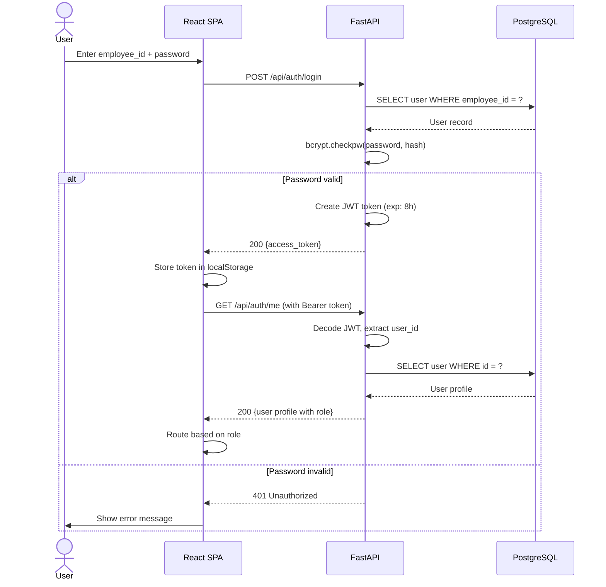
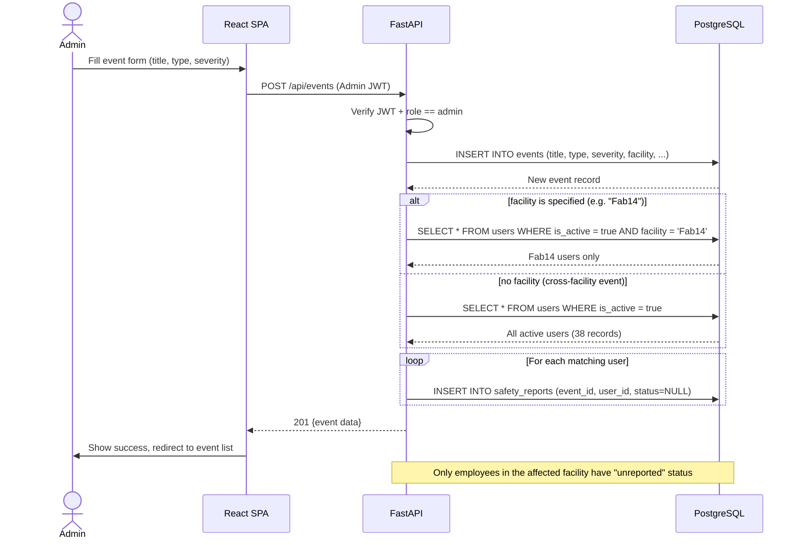
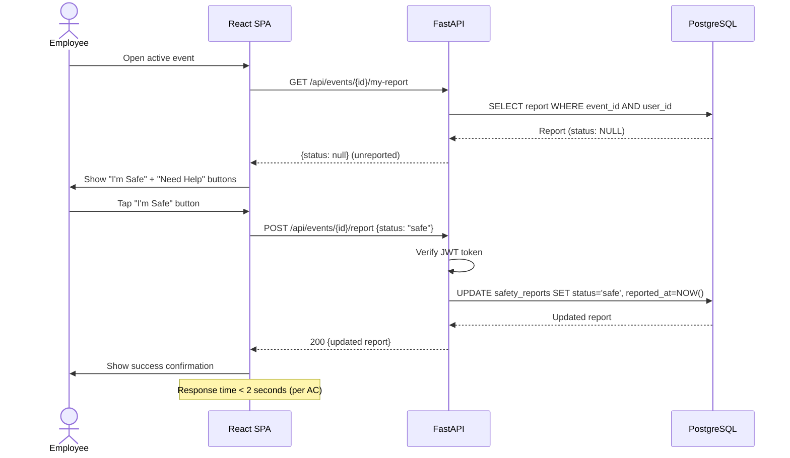
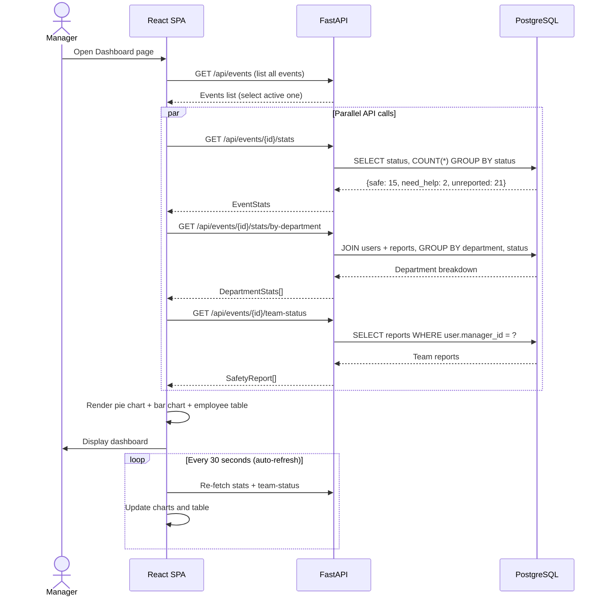
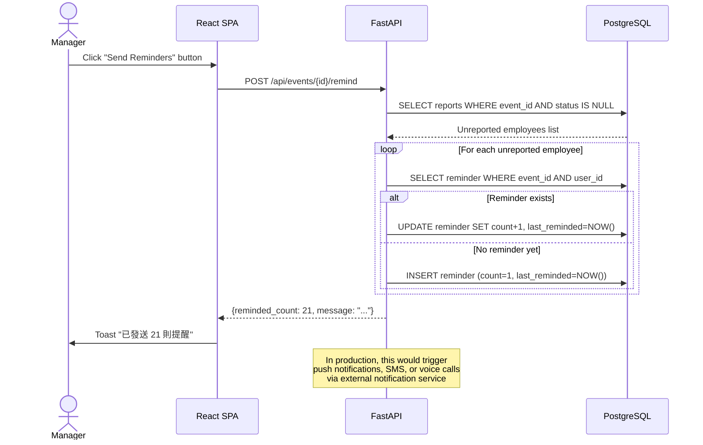
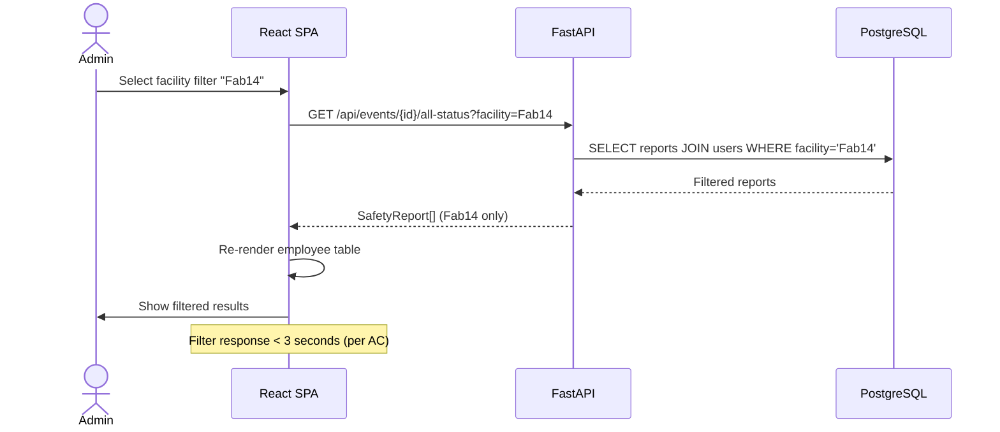

# Sequence Diagrams

## 1. User Login Flow

## 2. Emergency Event Creation Flow

## 3. Employee Safety Report Flow (Core Use Case)

## 4. Manager Dashboard Flow

## 5. Reminder Trigger Flow

## 6. Cross-Facility Filtering Flow

