# 系統架構與設計思路 (System Architecture & Design Rationale)

> Employee Safety & Response System — 第五組
> 本文件以**實際程式碼與 k8s manifest 為準**(非簡報),作為報告時回答架構問題的權威依據。
> 對應簡報的修正清單見最後一節「附錄 A:簡報勘誤」。

---

## 1. 一句話定位

災害(地震、火災…)發生當下,**上萬名員工在 30 分鐘 SLA 內一鍵回報安全狀態**;主管即時看儀表板掌握缺口;管理員建立與管理事件。三種角色(employee / manager / admin),JWT 驗證,部署在 GKE。

核心工程挑戰只有一個:**平時幾乎沒流量,災難當下瞬間湧入上萬筆寫入**。整個架構都是為了「削這個峰」而設計。

---

## 2. 邏輯架構 — 模組化單體 (Modular Monolith)

後端是 FastAPI 單一程式,內部切成自包含模組,每個模組有自己的 `router.py / schemas.py / models.py`,為未來拆微服務預留邊界:

| 模組 | 職責 |
|---|---|
| `auth` | 登入、JWT 簽發、`hash_password`(**bcrypt**) |
| `events` | 事件 CRUD、建立事件時產生 placeholder 回報列、催報 (remind) |
| `reports` | 提交回報、查個人回報、事件統計、部門統計 |
| `users` | 使用者管理 |
| `notifications` | 提醒 (Reminder) 相關 |

全部掛在 `app/main.py` 的 `/api/*` 底下(6 個 router:auth, events, reports, users, notifications, me_notifications)。

**設計原則:**
- **Async throughout** — SQLAlchemy 2.0 async + asyncpg。`app/database.py` 提供 `engine` / `Base` / `get_db()`(request-scoped session,成功 commit、例外 rollback)。
- **RBAC** — `app/dependencies.py` 的 `get_current_user` 解 JWT;`require_role(*roles)` 是 dependency factory。JWT payload `sub = user.id`(UUID)。
- **無 migration** — `app/init_db.py` 是獨立建表(+seed)腳本,由 Compose 的 `backend-init` 和 k8s 的 `db-init` Job 執行。App 啟動**不碰 schema**(避免多副本 race)。Alembic 裝了但沒用。

### 為什麼是單體而不是微服務?
**Monolith First**。目前負載單體完全撐得住(已壓測驗證 15K 並發);過早拆分只會徒增維運成本。模組邊界已備妥,規模到頂時再拆。

---

## 3. 請求生命週期 — 流量在系統裡怎麼走

> **關鍵觀念:單一 request 不會在 pod 之間移動。** 它落在「一個」backend pod 上從頭處理到尾。Pod 之間的「接力」是透過**共享的 Redis / Postgres** 間接完成,不是 pod 直接呼叫 pod。Pod 是無狀態的(JWT 自帶身份,沒有 server-side session),所以負載均衡器可以隨便挑。

系統依請求類型走**三條不同的路**:

```mermaid
flowchart TB
    C[Client 瀏覽器 SPA] -->|HTTPS| LB[Google Cloud HTTP&#40;S&#41; LB<br/>GKE Ingress · static IP · Managed TLS]
    LB -->|path /| FE[Frontend Pods<br/>nginx + React build]
    LB -->|path /api/*| BE[Backend Pods<br/>FastAPI · HPA 3→60]

    BE -->|① 讀 stats / events| RR[(cloudsql-proxy-replica ×2)]
    RR --> REPLICA[(Cloud SQL<br/>READ REPLICA)]

    BE -->|② 報平安寫| REDIS[(Redis<br/>write buffer + cache)]
    REDIS -.->|每 2s SCAN + 批次 flush| DR[Background drainer<br/>每個 backend pod 各一個 asyncio task]
    DR -->|batch UPDATE| PGB
    BE -->|③ 一般寫 建/改事件| PGB[PgBouncer ×3→6<br/>transaction pooling]
    PGB --> CSP[(cloudsql-proxy ×2<br/>Workload Identity · TLS)]
    CSP --> PRIMARY[(Cloud SQL HA<br/>PRIMARY · PostgreSQL 16)]
    PRIMARY -.->|streaming replication| REPLICA
```

### 三條路的細節

| 請求 | 路徑 | 特性 |
|---|---|---|
| **讀**(Dashboard 30s 刷新 `GET .../stats`) | pod → `get_read_db()` → **cloudsql-proxy-replica** → **Cloud SQL replica** | **繞過 pgbouncer**,打讀庫,卸載主庫 |
| **報平安寫**(`POST .../report`) | pod → **Redis 緩衝**(立刻回 200)→〔每 2s〕**drainer** → **pgbouncer** → cloudsql-proxy → **primary** | 非同步削峰,寫入不卡請求 |
| **一般寫**(建/改/刪事件) | pod → `get_db()` 同步 → **pgbouncer** → cloudsql-proxy → **primary** | 低頻、同步寫主庫 |

### 報平安寫的完整內幕(系統最核心的一段)

1. `POST /api/events/{id}/report` 落在某個 backend pod。
2. 該 pod 呼叫 `buffer_report()` 把回報寫進 **Redis**:
   - `buf:report:{event_id}:{user_id}`(Hash,存狀態/訊息)
   - `buf:events_with_pending:{event_id}`(Set,標記此事件有待刷資料),TTL 60s
   - 寫完**立刻回 200**(毫秒級),DB 還沒寫。
3. **降級保護**:若 Redis 不可用(或 `CACHE_DISABLED=1`),自動 fallback 成直接 `UPDATE` 主庫,**回報絕不遺失**。
4. **drainer**(`app/background.py`,每個 pod 內一個 asyncio task)每 `DRAIN_INTERVAL_SECONDS=2.0` 秒:
   - `SCAN buf:events_with_pending:*` → 找出有待刷的事件
   - 對每個事件 `drain_event_buffer()`,把所有緩衝回報用**一次 batch UPDATE** 寫進 Postgres
   - 寫入後 `cache_invalidate_pattern()` 讓該事件的統計快取失效(下次儀表板讀到新數字)
5. **graceful shutdown**:`stop_drainer()` 在 pod 關閉時取消迴圈並**做最後一次 drain**,SIGTERM 前緩衝的回報不丟(terminationGracePeriod 40s)。

> **讀寫一致性的小細節**:載入回報頁時,讀路徑會**先查 Redis 緩衝(`get_buffered_report`)再查 DB**,避免「剛寫入、還沒 flush」時讀到舊狀態(read-your-write)。

### Redis 同時是兩個東西
- **Write buffer**:吸收報平安尖峰(主用途)。
- **Cache**:事件列表、事件統計、部門統計的快取(`cache_get_json` / `cache_set_json`),寫入後失效。
- **Rate limiter**:催報的 `remind_limiter`(如 1 分鐘 5 次,超過回 429)。

---

## 4. 雲端部署拓樸 (GKE on GCP)

```mermaid
flowchart LR
    USER[User Browser HTTPS] --> ING[GKE Ingress<br/>Cloud HTTP&#40;S&#41; LB<br/>static IP + Managed TLS]

    subgraph GKE[GKE Cluster · safety-system]
      subgraph APP[Application Tier]
        FE[Frontend Pods<br/>nginx+React · HPA 2-10]
        BE[Backend Pods<br/>FastAPI · HPA 3-60]
      end
      subgraph DBT[DB Connection Tier]
        PGB[PgBouncer ×3→6<br/>txn pool · 2000→100]
        CSP[cloud-sql-proxy ×2]
        CSPR[cloud-sql-proxy-replica ×2]
      end
      subgraph OBS[Observability cluster-internal]
        PROM[Prometheus scrape 15s]
        GRAF[Grafana · kubectl port-forward]
      end
    end

    subgraph MNG[Managed Services · Private IP]
      SQL[(Cloud SQL HA PRIMARY<br/>PostgreSQL 16 · Regional)]
      SQLR[(Cloud SQL READ REPLICA)]
      MEM[(Memorystore / Redis :6379)]
    end

    ING -->|path /| FE
    ING -->|path /api/*| BE
    BE -->|SQL 5432 write| PGB --> CSP -->|TLS private IP| SQL
    BE -->|SQL 5432 read| CSPR --> SQLR
    SQL -.->|replication| SQLR
    BE -->|Redis 6379| MEM
    PROM -->|GET /metrics| BE
    PROM --> GRAF
    GHA[GitHub Actions CI/CD] -->|docker push| AR[Artifact Registry]
    AR -.->|image pull| FE
    AR -.->|image pull| BE
```

### 各層職責與副本數(以 manifest 為準)

| 元件 | 檔案 | 副本 | 角色 |
|---|---|---|---|
| GKE Ingress | `10-ingress.yaml` | — | Cloud LB,path routing:`/`→frontend、`/api`→backend、`/grafana`→grafana。Static IP `8.233.75.252`,Google-managed TLS(DuckDNS 網域) |
| Frontend | `08-frontend.yaml` + `09-hpa` | **2–10** | nginx 服務 React build(靜態),不 proxy `/api`(Ingress 直接路由 `/api` 到 backend) |
| Backend | `06-backend.yaml` + `07-hpa` | **3–60** | FastAPI/uvicorn :8000。**NEG 容器原生負載均衡**(LB 直打 pod,繞過 kube-proxy)。`preStop sleep 5` + grace 40s 做零停機輪替 |
| PgBouncer | `12-pgbouncer.yaml` + `12a-hpa` | **3–6** | Transaction-mode 連線池。把上千 client 連線多工成少量真連線。停用兩層 prepared-statement cache 以相容 txn pooling |
| cloud-sql-proxy | `13-cloudsql-proxy.yaml` | **2** | 透過 Workload Identity + 私有 IP 連 Cloud SQL **primary**(加密通道)。刻意做成獨立 Deployment 而非 sidecar,以保住 pgbouncer 的連線上限 |
| cloud-sql-proxy-replica | `13a-cloudsql-proxy-replica.yaml` | **2** | 同上,連 **read replica**(`safety-db-replica`)。**讀路徑專用,不經 pgbouncer** |
| Cloud SQL HA | (GCP) | Regional | PostgreSQL 16,跨可用區自動 failover,`max_connections=400` |
| Cloud SQL Replica | (GCP) | 1 | 讀副本,streaming replication |
| Redis | `REDIS_URL` in `01-configmap.yaml` | 1 | Write buffer + cache + rate limiter(見附錄 A 第 6 點關於 Memorystore vs in-cluster 的待釐清) |
| Prometheus/Grafana | `14`/`15` | — | 抓 `/metrics`(15s),16 個面板,5 條告警 |

### 連線數容量數學(為什麼要 PgBouncer)
- 無 pgbouncer:60 backend pods × 連線池(10+5)= **900 條**直連 → 遠超 Cloud SQL `max_connections=400` → 撐爆。
- 有 pgbouncer:backend → pgbouncer(每 pod `DEFAULT_POOL_SIZE` 條真連線)→ Cloud SQL。900 條 client 連線被**多工**成數百條真連線。
- ⚠️ **目前的數字不一致**(待修):`12-pgbouncer.yaml` 設 `DEFAULT_POOL_SIZE=100`,但 `12a-pgbouncer-hpa.yaml` 的註解假設 50。6 pods × 100 = **600 > 400**,HPA 打到頂時可能反而超賣 Cloud SQL 連線。建議把 pool size 統一為 **50**(6×50=300,留 100 給 admin/migration),或把 pgbouncer maxReplicas 降到 4。

---

## 5. 資料模型 (4 張表)

| 表 | 重點 |
|---|---|
| `users` | `employee_id`、`role`(employee/manager/admin)、`department`、`facility`、自參考 `manager_id`(直屬主管)、`is_active`(soft delete) |
| `events` | `event_type`、`severity`、`status`(active/closed)、`facility`(ARRAY,可限定廠區)、`closed_at` |
| `safety_reports` | `status`(null=未回報)、`message`、`reported_at`、以及 `manager_id_snapshot` / `department_snapshot` / `facility_snapshot`(**建立事件當下快照**,人事異動不影響歷史統計) |
| `reminders` | `reminder_count`、`department_snapshot`、催報紀錄 |

**核心業務邏輯:**
- **建立事件 = 預先產生 placeholder**:`POST /api/events` 會對每個相關使用者(全體或依 `facility` 篩選)插入一筆 `status=null` 的 `SafetyReport`。**這就是「未回報」的追蹤方式** —— placeholder 有列、但 status 還是空。回報就是把這列填上。
- **快照欄位**是設計亮點:統計用 `department_snapshot` 而非即時 join `users`,所以(a)人事異動不影響歷史統計、(b)儀表板查詢用 `(event_id, status)` 複合索引就很快。
- **權限分流**:管理員看全廠;主管的部門統計用 `department_snapshot == current_user.department` 過濾(`reports/router.py`);團隊狀態另用 `User.manager_id`(直屬部屬)。
- **催報批次寫入**:把「N 人最多 2N 次 SQL」壓成固定 **2 句**(既有提醒 `UPDATE` 累加 `reminder_count` + 新提醒 `INSERT`)。

---

## 6. 擴展性與韌性 (Scale & Resilience)

**水平擴展(削峰):**
- HPA:backend **3→60**(CPU 60%)、frontend **2→10**(CPU 70%)、pgbouncer **3→6**(CPU 70%)。
- Redis 寫入緩衝 + drainer 批次 flush:把瞬間上萬筆 `INSERT/UPDATE` 攤平成每 2 秒一次批次。
- 讀寫分離:儀表板的高頻讀打 replica,卸載主庫。

**高可用(消除單點):**
- 每層至少 2 副本(backend≥3、frontend≥2、pgbouncer≥3、兩個 proxy 各 2)。
- `topologySpreadConstraints` 跨可用區散佈;單一 zone 掛掉不會整層死。
- Cloud SQL Regional HA 跨區 failover;Memorystore 託管。
- **零停機輪替**:`maxUnavailable:0` + `maxSurge:1` + `preStop sleep 5` + grace 40s,讓 NEG 先把 endpoint 標記 NotReady 再送 SIGTERM,輪替期間不掉請求。
- **健康探針分離**:`/health`(liveness,便宜、不碰 DB,DB 抖動不該重啟 pod)、`/health/ready`(readiness,跑 `SELECT 1`,DB 不通回 503 不收流量)。

**壓測實證(15,000 人災害湧入):**
- 處理 **546K** 請求,成功率 **99.6%**(0.44% 失敗),尖峰 **2,409 RPS**;p50 ~900ms、p95 ~22s(尖峰)後回穩 1,500–2,400 RPS。系統**優雅降級而非雪崩**。

**已知瓶頸與處置:**
- **登入 bcrypt(已修)**:Extreme 情境上千人同時登入,同步 bcrypt 鎖死 CPU、HPA 來不及擴 → login p95 ~22s、失敗 ~98%。改成**在 thread pool 跑 bcrypt 不阻塞 event loop** + Locust 預熱 JWT token + 放大 seed 帳號池 → login p95 ~86ms、`/api/auth/login` 命中失敗 0、High Load 853 RPS。
- **drainer 寫入死鎖(未修,已記錄)**:drainer 在**每個 pod** 都跑一份。擴到 ~60 pods 時,N 個 drainer 同時對同一批 row 做 batch UPDATE → `DeadlockDetectedError`。臨時緩解:把 backend HPA 上限壓到 ~25(drainer 變少)。**正解**:把 drainer 改成**單例(leader election)或按 event 分片**,只讓一個 pod 負責刷。
- **30k 打不上去**:單台 M4 Pro 當壓測端受限於暫態埠(~16k)+ WAN 頻寬;backend 對外只用到 ~35% CPU,瓶頸在客戶端不在系統。

---

## 7. 安全性 (Security)

| 面向 | 實作 |
|---|---|
| **密碼雜湊** | **bcrypt**(`bcrypt==4.0.1`,`hash_password` = `bcrypt.hashpw`,`BCRYPT_ROUNDS`)。驗證在 thread pool 跑以免阻塞 event loop。**不是 Argon2**(見附錄 A 第 1 點) |
| 快取去敏感化 | 快取物件不含 `password_hash`;登入直查 DB |
| 認證/授權 | JWT(`python-jose`),`require_role(*roles)` 做 RBAC,前端 `ProtectedRoute` 依角色守衛路由 |
| 注入防護 | SQLAlchemy 參數化;Pydantic 嚴格 `Literal` 枚舉阻斷非法輸入;LIKE 萬用字元 `% / _` 轉義防全表掃描 |
| 網路 | `NetworkPolicy` default-deny(`11-network-policy.yaml`);DB 私有 IP;cloud-sql-proxy 用 **Workload Identity**(無長期金鑰) |
| 傳輸 | Google-managed TLS;proxy 到 Cloud SQL 走加密通道 |
| 前端韌性 | ErrorBoundary 優雅降級 |
| Secrets | `k8s/02-secret.yaml` gitignored;正式環境建議 GCP Secret Manager + CSI |

---

## 8. 可觀測性 (Observability)

- **Prometheus**:`prometheus-fastapi-instrumentator` 暴露 `/metrics`,每 15s 抓。
- **Grafana**:**16 個面板**,4 維度(HTTP 效能 / 業務 KPI / 組件健康 / K8s 狀態);PromQL 用 `vector(0)` 補基準線避免 No-Data 誤報;匿名檢視、kubectl port-forward。
- **5 條告警規則**:`HighErrorRate`(5xx>5%)、`HighLatency`(p95>1s)、`BackendDown`、`High4xxRate`(4xx>20%)、`BackendPodRestarting`(Pod 頻繁重啟)。

---

## 9. 測試策略 (四層金字塔)

| 層 | 工具 | 內容 |
|---|---|---|
| Unit | pytest / Vitest | 後端純邏輯(無 DB);前端 components / contexts / api / pages |
| Integration | pytest + PostgreSQL | 各模組 endpoint × 三角色 RBAC 矩陣;每測獨立 engine + transaction rollback 隔離 |
| E2E | Playwright | 4 spec,真實 Chromium 對完整 docker-compose stack;選擇器 locale-safe(預設 zh-TW) |
| Performance | Locust(獨立執行) | 15K/30K 災害湧入壓測,不進 CI |

CI(GitHub Actions):每次 push 跑前三層 + lint(ruff/eslint);合併 main 才觸發 build & GKE rolling deploy。SonarQube Quality Gate:Security A / Reliability A / Maintainability A、覆蓋率 ~80%、重複 1.6%。

---

## 10. 已知限制與 Roadmap

| 目前限制 | 下一步 |
|---|---|
| 單 region 部署,無跨 region 災備 | 多 region 災備 |
| 通知僅站內催報 | 串接 FCM/APNs 推播 / SMS / 語音外撥 |
| drainer 每 pod 一份 → 高 pod 數寫入死鎖 | drainer 單例化 / 按 event 分片(leader election) |
| 權限未依完整組織層級細分 | 權限細化、可設定催報閾值 |
| 求救按鈕防誤觸、離線重送 | 求救二次確認 + 離線回報快取重送 |

---

## 附錄 A:簡報勘誤 (對照實際程式碼)

> 嚴格比對 22 頁簡報與 codebase 後的出入清單。🔴=事實錯誤、🟡=數字過時/內部不一致、🟢=圖上箭頭/缺漏。

**🔴 1. 「Argon2」是錯的 — 實際用 bcrypt**(投影片 12「SonarQube」、22「程式碼品質與安全性」的安全性設計框)
程式碼用 **bcrypt**(`bcrypt==4.0.1`、`hash_password=bcrypt.hashpw`、`BCRYPT_ROUNDS`)。而且這與你自己的投影片 14「bottleneck: bcrypt」、16「bcrypt 改 async」**互相矛盾**。
→ 改成:`password_hash 不入 Redis;登入直查 DB;雜湊用 **bcrypt**(cost 可調、async 在 thread pool 跑)`。

**🟡 2. Grafana 面板/告警數過時**(投影片 7「災害尖峰流量怎麼撐住」)
寫「Grafana 7 面板、4 條告警規則」。實際:**16 面板**(`15-grafana.yaml` 有 16 個 panel)、**5 條告警**(`14-prometheus.yaml`:HighErrorRate / HighLatency / BackendDown / High4xxRate / BackendPodRestarting)。你的投影片 20、21 已經寫對(16/5),只有這頁是舊的。
→ 統一改成 16 面板、5 條告警。

**🟡 3. PgBouncer 標註過時 + 內部不一致**(投影片 6「Cloud Native Architecture」)
圖上「PgBouncer ×2、1000 → 50 conns」。實際 `replicas: 3`、HPA 3→6 → 應為 **×3(→6)**;`MAX_CLIENT_CONN=2000`、`DEFAULT_POOL_SIZE=100` → 應為 **2000 → 100**。
另外你的 repo 自己就不一致:`12a-pgbouncer-hpa.yaml` 註解假設 pool=50,但 `12-pgbouncer.yaml` 設 100;6×100=600 會**超過 Cloud SQL max_connections=400**。建議統一 pool=50。

**🟢 4.(最大缺漏)讀寫分離整個沒畫**(投影片 6)
圖只有一座 Cloud SQL HA + 一個 cloud-sql-proxy,所有 DB 流量都經 pgbouncer。實際有**讀副本路徑**:`get_read_db()` → **cloudsql-proxy-replica(2 pods)** → **Cloud SQL read replica**,而且**繞過 pgbouncer**。儀表板的高頻讀(你最重的負載)走的就是這條。這是賣點卻在圖上隱形。
→ 補一個 replica proxy box + replica DB,從 Backend 拉一條「read」箭頭直接到 replica proxy(不經 pgbouncer)。

**🟢 5. Redis 角色被低估**(投影片 6)
圖上只標「Memorystore Redis(cache)」。它的**主用途是報平安的寫入緩衝**(吸收尖峰 → 每 2s drain 進 PG),投影片 5 有畫對,但投影片 6 讓 Redis 看起來只是旁邊的快取。
→ 加「write buffer」標籤,或畫一條 Backend→Redis→(drain)→PG 的虛線。

**🟡 6. Memorystore vs in-cluster Redis 不一致**(投影片 6)
圖寫「Memorystore Redis BASIC tier(Managed/Private IP)」。但 `01-configmap.yaml` 的 `REDIS_URL=redis://172.27.0.3:6379` 註解還寫「keep pointing at the in-cluster redis pod (k8s/04-redis.yaml)」,而 `04-redis.yaml` 已不存在。172.27.x 私有 IP 與 Memorystore 一致,所以**投影片大概是對的**,但翻你 repo 的人會看到矛盾。
→ 清掉那段過時註解,讓「Redis 到底跑在哪」只有一個答案。

**🟢 7. Background Worker 畫成獨立服務會誤導**(投影片 5「系統架構圖」)
它是**每個 backend pod 內的一個 asyncio task**,不是獨立 Deployment。所以是 **N 個 drainer**(每 pod 一個),不是一個。這正是 30k 壓測寫入死鎖的根因(N pods 搶同一批 row)。建議加註解:「drainer 隨 backend pod 數量擴張」。順帶:「REST API Gateway」其實只是 FastAPI 的路由 + JWT dependency + rate-limit middleware,不是獨立 gateway 產品。

**🟢 8. 確認 flush 箭頭標籤**(投影片 5)
確認 drainer 那條「每 2s flush」箭頭指向 **PostgreSQL(batch UPDATE)**,不是「寫入快取」。

**✅ 經查證正確、可放心講的部分:**
backend HPA 3-60、frontend HPA 2-10;15K/546K/99.6%/2409 RPS;bcrypt 修正前後 p95 22s→86ms;「所有層至少 2 副本」;Ingress 路由 `/`→frontend、`/api`→backend(且**正確地沒有** frontend→backend 箭頭);主管部門範圍化(`department_snapshot` 過濾);5 條告警規則。
